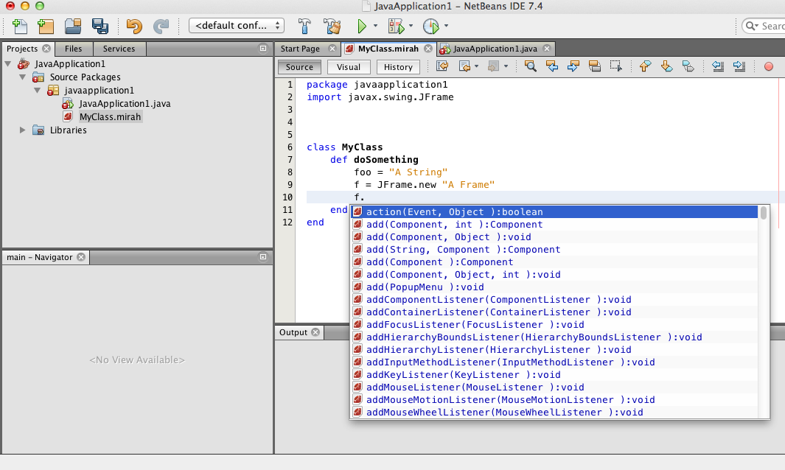
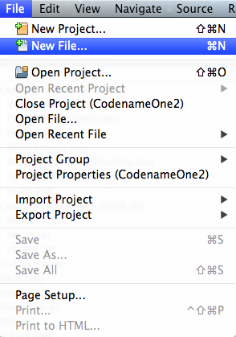
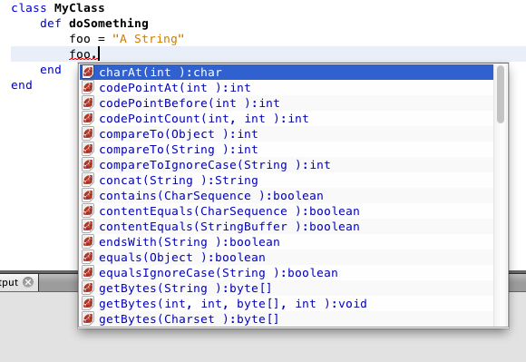
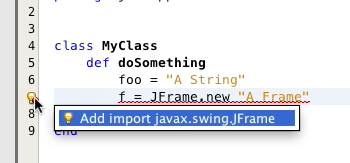

#Mirah Netbeans Module

A module to add Mirah support to Netbeans.

##Project Status

Alpha

This module includes both support for augmenting the build/compile process of certain NetBeans project types, and support for editing .mirah files in the code editor.  So far (Sept. 1, 2014) I have focused only on the Codename One and Java SE Application project types.  JavaEE and Java Web projects haven't been tested as thoroughly.

##Features

###Mirah (the language)

* Ruby-like syntax
* Statically compiled to JVM bytecode.
* Compiled code has no dependencies (you can deply code just as if it was compiled java).
* 2-way interrop between Mirah code and java code.
* As fast as Java

###Editor

* .mirah editor (to edit Mirah files).
* Syntax highlighting
* Method and property completion.
* Import hints
* Error highlighting
* Abstract method completion

###Building

* Seamless integration with Java projects.  You can add .mirah source files to your Java project in the same source tree, and they will be built like normal Java files.
* Support for 2-way dependency between Java and Mirah code.
* Comes packaged with Mirah compiler

##License

Apache 2.0

##Download

[ca-weblite-netbeans-mirah.nbm](https://s3.amazonaws.com/download.weblite.ca/mirah-nbm/ca-weblite-netbeans-mirah.nbm)

##Installation Instructions

1. [Download](https://s3.amazonaws.com/download.weblite.ca/mirah-nbm/ca-weblite-netbeans-mirah.nbm) the .nbm file.
2. In Netbeans, select "Tools" > "Plugins"
3. Click on the "Downloaded" tab, and click the "Add Plugins…" button.
4. In the file dialog, select the ca-weblite-netbeans-mirah.nbm module that you downloaded, and click "Open".
5. Follow the prompts as it is installed.

##Usage

###Screencast 

The following screencast demonstrates the use of the NetBeans Mirah plugin to develop a Codename One application using Mirah.

[Codename One Mirah Poker Demo Screencast](http://youtu.be/uGgppdsMCjA)

###Creating a Mirah Class

1. Access the "New File" wizard inside an existing Java project.  (e.g. Select File > "New File…").

2. One of the file types should be "Mirah Class".  Select this option.

3. Click "Next".  This will take you to a form to enter the name, package, etc.. of your class.

4. Click "Finish".  This should add your class to the specified directory, and open it in the editor.

###Method Completion

Method completion is a little bit rough, but it works in most cases.

1. Press Ctrl-Space after typing ".", and it will present a drop-down list of available methods on this object.

###Import Hints

If you use a class or symbol that hasn't been imported into the file's scope, you will receive a hint in the margin that allows you to select appropriate classes that it has found in the classpath and add the import statement automatically.

##Limitations

This was the first Netbeans module of this complexity that I have written, and there is still much to do.  It does handle method completion, but it is still a little clunky and only provides autocomplete for those methods that it could introspect using Java reflection.  This doesn't include Rubyisms like the List.each() method, and it currently doesn't include properties or static fields.

There also isn't any support for refactoring operations, either from a producer or consumer standpoint. 

## Bugs

Report bugs in the [issue tracker](https://github.com/shannah/mirah-nbm/issues)

##Building from Source

1. Clone the repo
2. Open project in Netbeans
3. Build project

##Contributions

Mirah is awesome, but the community is small right now.  Make it better by forking and improving any of the following projects:

1. This project
2. The [Mirah Ant Task](https://github.com/shannah/mirah-ant) (used by the Netbeans module to perform builds)
2. The [Mirah Project](https://github.com/mirah/mirah) (Includes the Mirah compiler and CLI tools)
3. The [Mirah Parser](https://github.com/mirah/mirah-parser) Project (Used by the Mirah compiler for parsing source)

##References

* [The Mirah Website](http://www.mirah.org/)
* [The Mirah Github Repository](https://github.com/mirah)
* [The Mirah Wiki](https://github.com/mirah/mirah/wiki)

##Credits

1. Module developed and maintained by [Steve Hannah](http://sjhannah.com)
2. Mirah created by [Charles Nutter](http://blog.headius.com/)
3. Thanks to [Nick Howard](https://github.com/baroquebobcat) and [Ryan Brown](https://github.com/ribrdb) for their stewardship of the Mirah project in recent years, and for their guidance in building this module.

