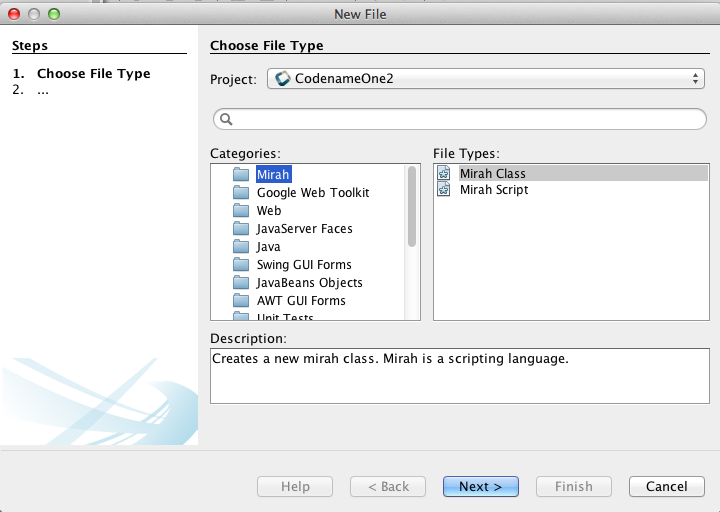
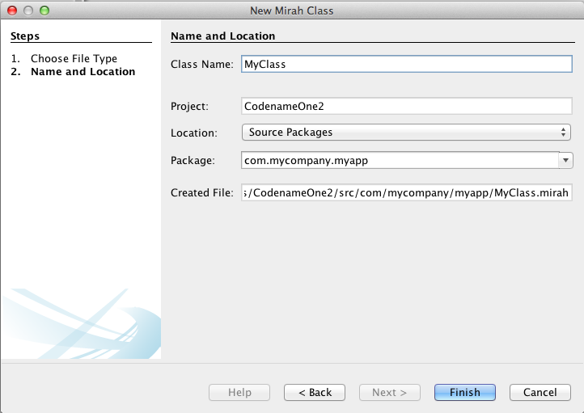
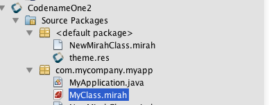
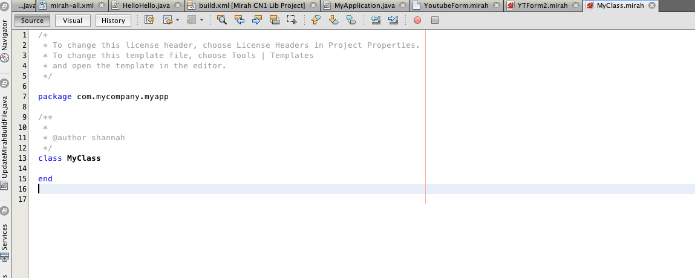

#Mirah Netbeans Module

A module to add Mirah support to Netbeans.

##Features

###Mirah (the language)

* Ruby-like syntax
* Statically compiled to JVM bytecode.
* Compiled code has no dependencies (you can deply code just as if it was compiled java).
* 2-way interrop between Mirah code and java code.
* As fast as Java

###Editor

* .mirah editor (to edit Mirah files).
* Syntax highlighting
* Method and property completion.
* Import hints
* Error highlighting

###Building

* Seamless integration with Java projects.  You can add .mirah source files to your Java project in the same source tree, and they will be built like normal Java files.
* Support for 2-way dependency between Java and Mirah code.
* Comes packaged with Mirah compiler

##License

Apache 2.0

##Download

[ca-weblite-netbeans-mirah.nbm]()

##Installation Instructions

1. [Download]() the .nbm file.
2. In Netbeans, select "Tools" > "Plugins"
3. Click on the "Downloaded" tab, and click the "Add Plugins…" button.
4. In the file dialog, select the ca-weblite-netbeans-mirah.nbm module that you downloaded, and click "Open".
5. Follow the prompts as it is installed.

##Usage

###Creating a Mirah Class

1. Access the "New File" wizard inside an existing Java project.  (e.g. Select File > "New File…").

2. One of the file types should be "Mirah Class".  Select this option.

3. Click "Next".  This will take you to a form to enter the name, package, etc.. of your class.

4. Click "Finish".  This should add your class to the specified directory, and open it in the editor.

###Method Completion

